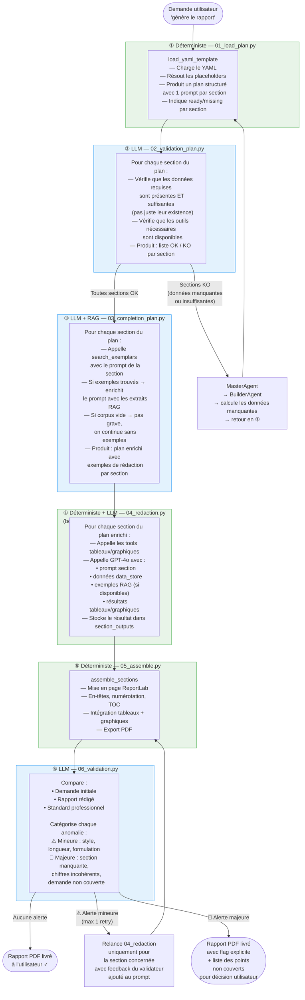

# Architecture WriterAgent — Génération de rapport PDF



## Légende

| Couleur | Rôle |
|---------|------|
| 🟢 Vert — Déterministe | Logique Python pure, résultat prévisible, zéro token LLM |
| 🔵 Bleu — LLM | GPT-4o intervient pour juger, enrichir ou rédiger |

## Les 6 étapes

| Fichier | Type | Rôle |
|---------|------|------|
| `01_load_plan.py` | Déterministe | Charge le YAML, résout les placeholders, produit le plan |
| `02_validation_plan.py` | LLM | Vérifie que données et outils sont présents ET suffisants |
| `03_completion_plan.py` | LLM + RAG | Enrichit chaque prompt de section avec des exemples de rédaction |
| `04_redaction.py` | Boucle Python + LLM | Rédige chaque section avec tables, graphiques et GPT-4o |
| `05_assemble.py` | Déterministe | Assemble le PDF final (ReportLab) |
| `06_validation.py` | LLM | Vérifie cohérence globale et qualité professionnelle |

## Gestion des alertes en ⑥

**Alerte mineure** (style, longueur, formulation vague)
→ 1 retry ciblé sur la section concernée uniquement, avec le feedback du validateur ajouté au prompt de rédaction. Maximum 1 retry — jamais de boucle infinie.

**Alerte majeure** (section manquante, chiffres incohérents, demande non couverte)
→ Le rapport est livré tel quel avec un flag explicite et la liste des points non couverts. Pas de retry automatique — une alerte majeure signale soit un problème de données (qui aurait dû être détecté en ②), soit une limite structurelle. L'utilisateur décide de la suite.

## Principes clés

**Le RAG est préparé en amont (③), pas pendant la rédaction (④)**
L'agent de rédaction reçoit déjà les exemples dans son prompt — il n'a pas besoin de décider d'aller chercher ou non. Cela simplifie la boucle ④ et évite des appels RAG aléatoires.

**La validation des données (②) est séparée de la rédaction (④)**
Si des données manquent, on le sait avant de commencer à rédiger. La boucle ④ peut tourner sans interruption.

**Un seul point de retour vers le MasterAgent**
Uniquement en ② si des données sont insuffisantes. La boucle ④ ne remonte jamais vers le Master.
```
